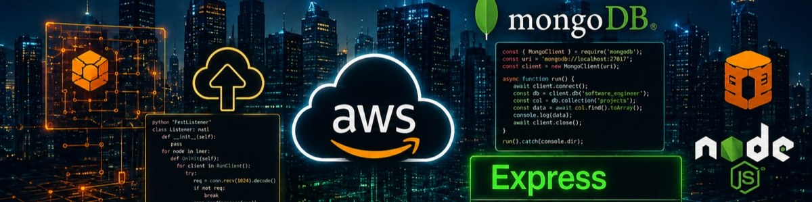

<div align="center">


<a href="https://git.io/typing-svg">
  
</a>

<br/>


<br/>


</div>

---

### 🧑‍💻 Who I Am

```typescript
const asifKalam = {
  title: "Software Engineer",
  focus: "Backend & Cloud Development",
  stack: {
    languages: ["Java", "Python", "C++", "C", "JavaScript", "SQL"],
    backend: ["Node.js", "Express.js", "REST APIs", "Socket.io"],
    frontend: ["React.js"],
    cloud: ["AWS EC2", "S3", "Lambda", "IAM", "RDS", "DynamoDB", "CloudWatch", "CloudFormation", "VPC"],
    databases: ["MySQL", "MongoDB", "Amazon RDS", "Amazon DynamoDB"],
    tools: ["Git", "VS Code", "Postman", "AWS CLI"],
  },
  launchedProjects: [
    "Cloud-Based E-Learning Platform",
    "2048 Game — Browser-Based Web Application",
  ],
  certifications: [
    "AWS Academy Cloud Foundations — Amazon Web Services",
  ],
  status: "Cloud Engineer Intern @ EduSkills",
  openTo: "Full-time Software Engineering roles (Backend / Cloud)",
};
```

---

### 🚀 Featured Projects

#### ☁️ Cloud-Based E-Learning Platform

Multi-role, service-based e-learning backend with JWT auth and production-style AWS deployment, built for distinct student and instructor workflows.

| Layer | Technology |
|---|---|
| Frontend | React.js |
| Backend | Node.js, Express.js, JWT |
| Real-time | Socket.io |
| Database | MongoDB (compound indexing, query projection) |
| Cloud | AWS EC2, S3, CloudFront, VPC, IAM, CloudWatch |

- Backend hosted on EC2 within a custom VPC, static assets served via S3 + CloudFront
- IAM roles and security groups applied with least-privilege principles
- Optimised MongoDB queries, cutting average API response time from ~320ms to under 200ms

#### 🎮 2048 Game — Browser-Based Web Application

A complete game engine built from scratch in vanilla JavaScript using a strict MVC pattern.

| Layer | Technology |
|---|---|
| Structure | HTML5, CSS3 |
| Logic | JavaScript (Vanilla), MVC Architecture |
| Persistence | localStorage API |

- Custom tile-merging algorithm handling all directional moves and edge cases
- Offline-capable best-score tracking with no backend dependency

---

### 🛠️ Tech Stack

<div align="center">

</div>

<br/>

**Languages**


**Frontend**


**Backend / Infra**


**Cloud**


**Databases**


**Dev Tools**


---

### 📊 GitHub Stats

<div align="center">


</div>

### 🏆 Trophies

<div align="center">


</div>

### 📈 Contribution Activity

<div align="center">


</div>

---

### 🔗 Connect With Me

<div align="center">

[](https://www.linkedin.com/in/asif-kalam-aa4b4924b/)
[](mailto:asifkalam.2003@gmail.com)

</div>


